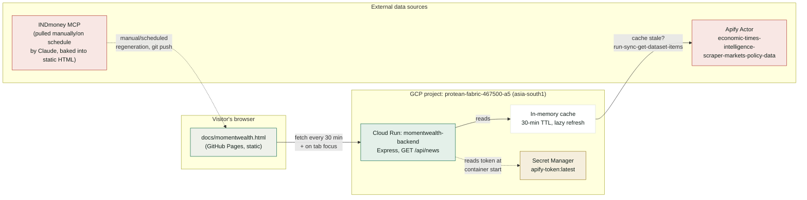

# momentWealth — Live News Architecture

How the auto-refreshing "Live wire" panel on [momentwealth.html](../docs/momentwealth.html) works end to end.

## Components

| Piece | What it is | Where |
|---|---|---|
| Frontend | Static HTML/CSS/JS, no build step | [`docs/momentwealth.html`](../docs/momentwealth.html), served by GitHub Pages |
| Backend | Express service, one route (`GET /api/news`) | [`momentwealth-backend/`](.), deployed to Cloud Run |
| Cloud project | `protean-fabric-467500-a5`, region `asia-south1` | Google Cloud |
| Secret | `apify-token` (Secret Manager) | mounted into Cloud Run as `APIFY_TOKEN` env var via `--set-secrets` |
| News source | Apify actor `complex_intricate_networks/economic-times-intelligence-scraper-markets-policy-data` | called via `run-sync-get-dataset-items` |
| Market/fund data | INDmoney MCP tools | pulled on demand by Claude and written directly into the static HTML — **not** live-fetched by the browser |

## Request flow (live news panel)

1. Browser loads `momentwealth.html`; its JS immediately calls `GET /api/news` on the Cloud Run service, then repeats every 30 minutes and whenever the tab regains focus.
2. The backend checks its in-memory cache. If the cache is empty or older than 30 minutes, it calls Apify's `run-sync-get-dataset-items` endpoint for the configured actor (reading `APIFY_TOKEN` from the environment, itself sourced from Secret Manager) and refreshes the cache. Concurrent requests during a refresh await the same in-flight promise instead of triggering duplicate Apify runs.
3. Otherwise it serves the cached JSON straight away — cheap and fast, and keeps Apify usage bounded regardless of visitor traffic.
4. The response is rendered into the "Live wire" panel with a relative "updated Xm ago" timestamp. If the backend is unreachable or `error` is set, the panel falls back to a static message rather than breaking the page.

## Security notes

- CORS on the backend is scoped to `https://nrusimhaviewa-byte.github.io` only — no wildcard, so the endpoint (and the Apify credits behind it) can't be hot-linked from other origins.
- `APIFY_TOKEN` lives only in Secret Manager, mounted at container start; it is never committed to the repo, never embedded in the frontend, and never passed through any AI-agent tool call.
- Cloud Run scales to zero on idle — no baseline compute cost when there's no traffic.

## What's *not* live-refreshed

Stock/ETF/mutual-fund prices, the momentum watchlist, and market commentary are sourced from INDmoney MCP and web research, then written directly into the static HTML by hand (or by a future scheduled Claude run — see the "scheduled regeneration" option considered alongside this backend). Only the news panel is genuinely live in-browser; wiring price data the same way would need either a public market-data API safe to call from a browser, or extending this backend to also proxy INDmoney-derived data.
